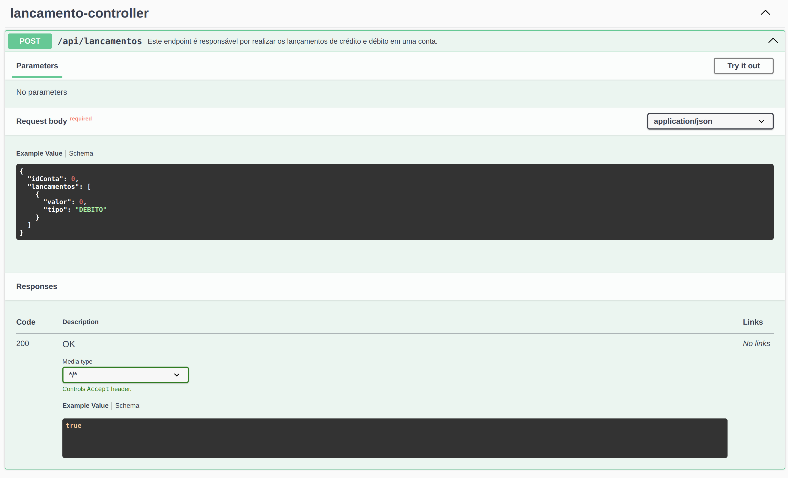

# API RESTful para realizar lançamentos bancários de débito e crédito

- Esta é uma aplicação RESTful para realizar uma pequena demonstração de controle requisições concorretes, para que
a API seja thread-safe, e também tratando condições de corrida para garantir a consistência dos dados.

- Para a documentação da API foi utilizado o swagger, que pode ser acessado pela URL http://localhost:9090/swagger-ui.html .

## Índice

- [Pré-requisitos](#pré-requisitos)
- [Instalação](#instalação)
- [Documentação técnica](#doctec)
- [Uso](#uso)
- [Funcionalidades](#funcionalidades)
- [Contribuição](#contribuição)
- [Licença](#licença)

## Pré-requisitos

- Java SDK 17
- Apache Maven
- Banco de Dados: não é necessária nenhuma instalação, pois a aplicação utiliza o H2 em memória. Após a aplcação ser
executada, o H2 pode ser acessado pelo console: http://localhost:9090/h2-console/ e informandos os parâmetros de
conexão informado no application.yaml.


## Instalação

1. Clone o repositório:
    ```sh
    git clone https://github.com/duduavilalima/lancamentos-conta.git
    cd lancamentos-conta
    ```

2. Instale as dependências usando Maven:
    ```sh
    mvn install
    ```

3. Execute a aplicação:
    ```sh
    mvn spring-boot:run
    ```

## Documentação técnica

- Para realizar os controles de concorrência e thread-safe, foram utilizadas algumas anotações do JPA/Spring e alguns
métodos foram definidos como synchronized. Isso pode ser visto na classe LancamentoServiceImpl.
- A classe de serviço LancamentoServiceImpl é chamada pelo endpoint "/api/lancamentos", que se encontra no RestController
LancamentoController. O serviço é responsável pela execução em sequência dos UseCases (lógica de negócio) de criação dos
lançamentos e pela atualização do saldo da conta.
```
  @Transactional(isolation = Isolation.SERIALIZABLE, rollbackFor = Exception.class)
  @Override
  public synchronized Boolean realizarLancamentos(LancamentoDto lancamentoDto)
```
- Os UseCases são executados em sequência, a cada lançamento é realizada a atualização do saldo. 
- Para garantir ainda o controle de condição de corrida, foi utilizada a atualização do saldo de forma atômica 
pelo SGBD, que pode ser visto no respositório ContaRepository, no método updateSaldo, onde o cálculo e a atualização
do saldo é feito por SQL.
```
    @Modifying
    @Query("UPDATE Conta conta SET conta.saldo = conta.saldo + :valor WHERE conta.id = :idConta")
    void updateSaldo(@Param("idConta") Long idConta, @Param("valor") Double valor);
```
## Uso

Para utilizar a aplicação:

1. Acesse a aplicação em `http://localhost:9090/swagger-ui.html`, caso essa porta esteja em uso, atualize o arquivo application.yaml
e altere a propriedade "port: 9090", repita os passos 2 e 3.
2. Utilize a API para realizar operações. A aplicação possui dois endpoints explicados abaixo com exemplos de payload.

- Consulta de saldo: Este endpoint é responsável por recuperar o saldo de uma conta específica.
```
Entrada: parâmetro {id}, passado pela url, do tipo Long.

Saída: saldo da conta. Valor numérico do tipo Double.
```
Abaixo a visualiação no swagger desse  endpoint. 


- Realizar lançamentos: Este endpoint é responsável por realizar os lançamentos de crédito e débito em uma conta.
```
Entrada: esta é uma requisição do tipo POST, logo o payload e passado pelo body da requisição. Abaixo um exemplo de payload

{
  "idConta": 1,
  "lancamentos": [
    {
      "valor": 125.69,
      "tipo": "DEBITO"
    },
    {
      "valor": 1025.69,
      "tipo": "CREDITO"
    },
    {
      "valor": 250143.87,
      "tipo": "DEBITO"
    },
    {
      "valor": 12045.09,
      "tipo": "CREDITO"
    }
  ]
}

Saída: valor booleano para indicar se a atualização teve sucesso. 
```
Abaixo a visualiação no swagger desse  endpoint.



## Contribuição

1. Faça um fork do projeto
2. Crie uma branch para a sua feature (`git checkout -b feature/nova-feature`)
3. Faça commit das suas alterações (`git commit -m 'Adicionar nova feature'`)
4. Faça push para a branch (`git push origin feature/nova-feature`)
5. Abra um Pull Request

## Licença

Este projeto está licenciado sob a Licença MIT - veja o arquivo [LICENSE](LICENSE) para mais detalhes.